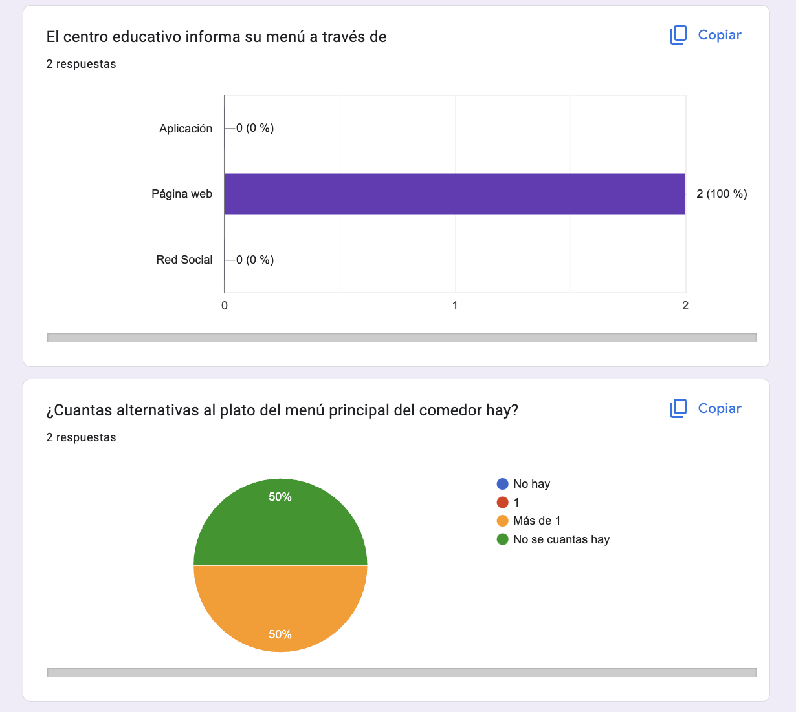
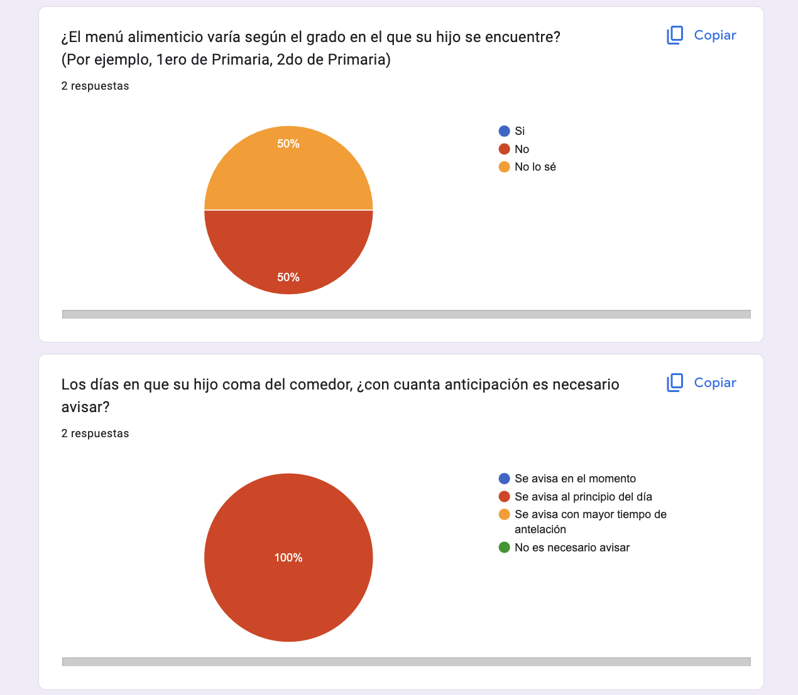
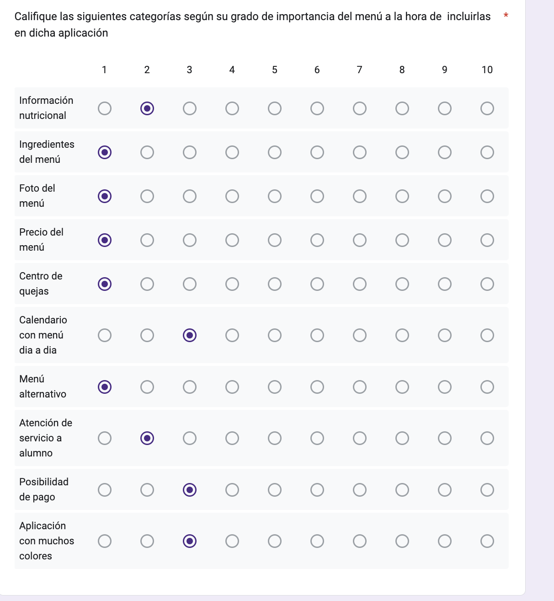
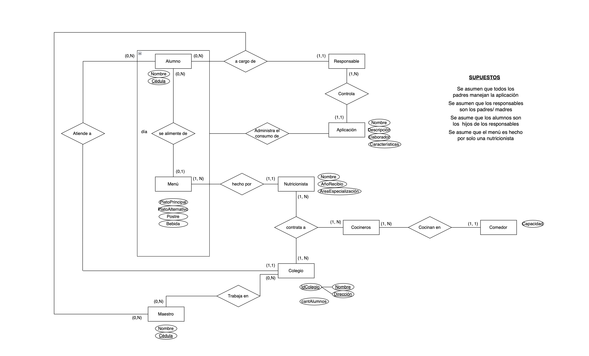
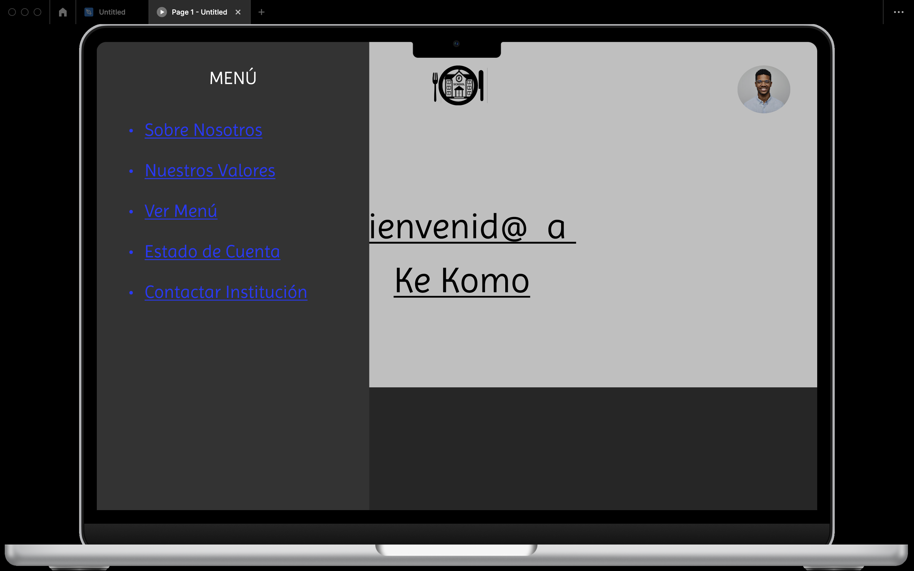

# Informe entrega 1

## Repositorio Git

### Creación y uso de repositorios locales y remotos
    A partir del repositorio remoto creado, cada integrante creó un repositorio local en su dispositivo, teniendo cada uno de estos los archivos del proyecto a mano. Cada vez que se realizaba un cambio, luego de capturarlo en el repositorio local, se lo pusheaba al repositorio remoto, debiendo el otro integrante a actualizar su repositorio local con los nuevos cambios. Lo mismo ocurría viceversamente.

### Comandos Git ejecutados desde terminal y desde IDE
    Utilizamos los siguientes comandos:
    - git clone
    - git add
    - git commit -m ""
    - git pull
    - git push
    - git log
    - git status
    - git branch
    - git checkout
    - git merge

##  Versionado

### Aplicar buenas prácticas de versionado
    A lo largo del proyecto, dimos uso de buenas prácticas del versionado. Un ejemplo de estas son;
    - Se utilizaron nombres claros y concisos para cada commit, indicando cada cambio realizado.
    - Se creó una rama develop, en donde se guardaba cada cambio. Al verificar que haya quedado todo bien, se vinvulaba esta rama con la rama main.

### Uso de ramas separadas de 'main'

### Resumen de commits y evolución del proyecto

## Elicitación

### Evidencia de actividades de investigación

#### Entrevistas

#### Cuestionarios
    El siguiente cuestionario tiene como público objetivo a alumnos del centro educativo
    
    
    

    El siguiente cuestionario tiene como público objetivo a usuarios de la aplicación, es decir, padres/ madres/ tutores
    
    
    
    
    
    
    
    
    

#### Ingenieria_Inversa

#### User Personas
    Perfil/ Características: Ana, madre de 2 niños en Primaria
                             Niños de 8 y 10 años
                             Ella tiene 43 años, es abogada
    Contexto: No le gusta cocinar
              Le importa la nutrición
              Usa ig/ wpp pero solo lo mínimo, lo básico
              No tiene computadora
              No usa otras apps de redes sociales
    Objetivos o expectativas:  “espero que mis hijos tengan una mejor nutrición y poder monitorear lo que consumen día a día”

    Perfil/ Características: Enrique, padre de 1 niño en Primaria
                             Niño tiene 7 años
                             El tiene 37 años, es albañil
    Contexto: No le gusta cocinar
              No le importa la nutrición
              Usa algunas redes sociales como wpp/ ig/ twitter
              Tiene computadora
    Objetivos o expectativas:  espero tener un registro detallado del consumo de mi hijo

    Perfil/ Características: Pablo, no tiene hijos
                             El tiene 25 años
                             Trabaja en la cocina del comedor del colegio
    Contexto: Forma parte del equipo administrativo de la cocina
              Domina todas las redes sociales
              Tiene computadora
    Objetivos o expectativas:  “espero que el sistema nos oriente a gastar menos”

### Referencias a fuentes de información
    Como principal fuente de información, utilizamos la documentación de archivos Markdown. La misma se puede encontrar a través del siguiente enlace;
    [**DOCUMENTACIÓN**](https://github.github.com) 

### Caracterización de usuarios: User Personas

### Modelo Conceptual del problema
Para modelar el problema, utilizamos un modelo entidad relación, y un glosario

MER: 

Glosario:

Dias de la semana: Consideramos que los días de la semana se consideran de Lunes a Viernes para ver que Menú hay en estos días.

Usuarios: Consideramos que los usuarios son los responsables de los alumnos siendo Padre/ Madre/ Tutor.

Gerente de cocina: Es rol dentro de la cocina del comedor encargada de la parte de ventas.

Reservas: Para que un alumno pueda comer del comedor, este debe reservar un lugar por sus responsables.

Auxiliar de Servicio/Cocinero: Personas que son responsables de cocinar las comidas para los alumnos.

Maestro: Persona al mando de formar académicamente a sus alumnos.

Comensal: Persona que consume sus órdenes en el comedor.

## Especificación

### Definición de requerimientos funcionales y no funcionales

#### Requerimientos Funcionales
    
    RF#1:
    - *Titulo:* Iniciar Sesión
    - *Descripción:* El usuario debe iniciar sesión al sistema con su cédula
    - *Prioridad:* Media

    RF#2:
    - *Titulo:* Informar menú
    - *Descripción:* El colegio debe informar acerca del menú mensual a fin de cada mes
    - *Prioridad:* Alta

    RF#3:
    - *Titulo:* Plataforma para pagar
    - *Descripción:* El usuario puede optar por pagar el menú desde la aplicación o por ejemplo, incluirlo a la cuota del colegio
    - *Prioridad:* Alta

    RF#4:
    - *Titulo:* Momento para pagar
    - *Descripción:* El usuario puede optar por pagar el menú desde el mismo día realizado el consumo, hasta el día anterior transcurrido el mes
    - *Prioridad:* Alta

    RF#5:
    - *Titulo:* Tarjetas para pagar
    - *Descripción:* El sistema debe aceptar tarjetas de crédito o débito como medio de pago
    - *Prioridad:* Alta

    RF#6:
    - *Titulo:* Generar factura
    - *Descripción:* El sistema debe generar una factura en el mismo día realizado el consumo, indicando dicho consumo del alumno
    - *Prioridad:* Alta

    RF#7:
    - *Titulo:* Gestionar reserva
    - *Descripción:* El usuario puede gestionar la reserva del menú para cualquier día dentro del mes, eligiendo que alimentos del menú desea reservar
    - *Prioridad:* Alta

    RF#8:
    - *Titulo:* Contactar institución
    - *Descripción:* El usuario puede contactarse con el colegio, en caso de, por ejemplo, algún inconveniente
    - *Prioridad:* Alta

    RF#9:
    - *Titulo:* Información nutricional
    - *Descripción:* El usuario puede, si desea, ver la información nutricional de los alimentos del menú
    - *Prioridad:* Alta

#### Requerimientos no funcionales

    -RNF#1:
    El sistema debe soportar 500 personas realizando una reserva en forma simultánea sin una degradación del tiempo de respuesta mayor a 5 segundos.

    -RNF#2:
    La interfaz de usuario de la aplicación será HTML5 y Javascript.

    -RNF#3:
    Los usuarios tendrán disponibles aplicaciones móviles compatibles con IOS 13 o superior y con Android 8 Oreo o superior.

    -RNF#4:
    Las aplicaciones de usuarios deben cumplir con las condiciones para ser publicables en Apple Store y Google Play Store.

    -RNF#5:
    La aplicación no debe pesar más de 500 mb.

    -RNF#6:
    La aplicación debe ser responsiva.

    -RNF#7:
    La aplicación se puede usar por la web, como también por descarga.

### User Stories / Use Cases detallados

### Bocetos de IU
    Los siguientes bocetos están destinados para el usuario:
    
    
    
    
    
    

    Los siguientes bocetos están destinados para empleados del comedor:
## Validación y verificación

### Verificar la especificación

### Validar la solución con personas no involucradas en el proyecto

## Reflexión

### Detalle del trabajo individual

### Técnicas aplicadas y aprendizajes
    **Técnicas utilizadas:** 
    - User personas
    - Encuestas
    - Entrevistas
    - Use cases
    - Ingenieria inversa
    - Aplicación de UI 
    - Verificación y Validación del proyecto
    - Técnicas de versionado 
    - User personas
    - Requerimientos funcionales y no funcionales
    - Modelo conceptual
    - User stories
