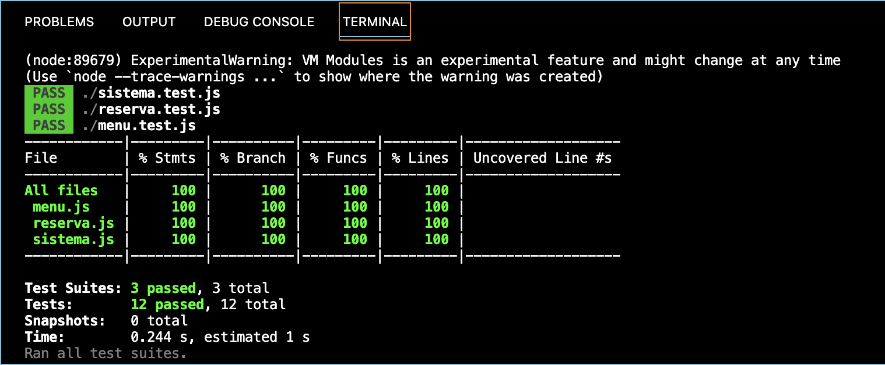
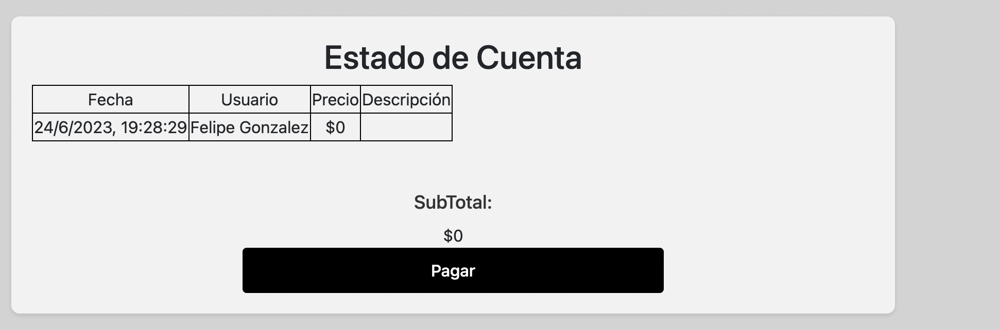

# Informe entrega 2

## Construcción

### Implementacion de Funciones Principales (sin la necesidad de persistencia de datos)
Las principales funciones de nuestro proyecto que implementamos fueron, para empezar, la de la navegación entre distintas partes de la página. Seguido a esto, la función de elegir el menú mensual. En esta seccion se puede elegir el día en específico dentro del rango, y dentro de este, los alimentos deseados, como también reservar la cantidad deseada de menús. Estado de Cuenta. En esta sección, se informa sobre los alimentos reservados, especificando sus detalles.

### Documentación del uso de librerías externas(package.json)
En cuanto a las librerías del package json, solamente utilizamos eslint, el cual indica problemas textuales en html, css y js, y jest, utilizado para testear las funciones implementadas.

## Interfaz de usuario

### Interfaz de usuario web / mobile (responsive)
La interfaz de usuario tiene la propiedad de ser responsiva. Esto es, que esta se ajusta a todas las pantallas, independientemente del ancho que tengan.

### Página única con navegación entre secciones
A su vez, para la interfaz de usuario se utilizó una única página, permitiendo la navegación entre distintas secciones de esta.

### Buenas prácticas de implementación de frontend
Algunas de las buenas prácticas de implementaión de front-end que utilizamos son las siguientes:
- Comentado de las principales funciones y principales procedimientos, especificando qué realizan
- Las hojas de estilo y scripts utilizados, estan separados en distintos archivos, dividiendo claramente la parte de dominio e intefaz
- Los distintos archivos del código están formateados por el sistema por defecto de visual code, para así alinear y organizar el código. Posteriormente se ajustan para evitar los errores de la librería eslint.

### Seguir specificación de estilo
En su mayoría, se intenta seguir con la especificación de estilo dictada en la especificación del proyecto realizado.

### Cumplimiento de estándar de accesibilidad WCAG
Por último, se cumple con el estándar de accesibilidad de WCAG, eliminando la totalidad de errores existentes. 
foto

## Codificación

### IDE Visual Studio Code: configuración común del equipo
Como IDE para la implementación de este proyecto, ambos integrantes del equipo utilizamos la aplicación de Visual Studio Code.

### Estándares de codificación (HTML, CSS, JavaScript): Google Style
Para la implementación del código, para generar una codificación limpia y legible, utilizamos el estandar de codificación de Google.

### Buenas prácticas de OOP: eparación de lógica e interfaz
Como buena práctica de codificación, mencionada en la sección anterior, los archivos codificados fueron divididos en distintas carpetas, separando la parte lógica de la interfaz.

## Test unitario

### Test unitarios en Jest
La codificación del dominio fue cubierta al 100% bajo test unitarios en Jest. A continuacion se adjunta la evidencia

## Reflexión

### Técnicas aplicadas y aprendizajes
Durante esta segunda entrega del proyecto, tuvimos a disposición varias herramientas que nos facilitaron la elaboración de lo que sería el "producto final". Al comienzo, nos costó definir como resultaría ser la interfaz de la página en general, respetando la restriccion de únicamente elaborar una página. Tuvimos que evaluar si pondríamos toda la información en una misma sección, de modo que el usuario fuese desplayandose hacia abajo para verla toda, hasta lo que sería como verdaderamente fué realizado, que fue la información puesta en distintas secciones y únicamente mostrando en la página dependiendo de la interacción que haga el usuario.
Aprendimos a trabajar con librerías como EsLint y Jest, las cuales brindaron una increible utilidad y aporte al trabajo, para así poder generar una codificación más "limpia" y entendible dentro del mismo equipo.

### Cambios pendientes
Una vez ya hecha la entrega final de la parte de codificación, al volver a probar el resultado final de la página, hemos notado de que nos quedaron pendientes algunos cambios. Para empezar, seleccionando un día en el calendario, el sistema te permite ingresar una reserva sin haber seleccionando ninguna casilla de plato principal, alternativo o postre, solamente poniendo una cantidad mayor a cero. Esto no debería de suceder. El error se puede observar con mayor facilidad en la sección de Estado de Cuenta, donde la descripción del encargo realizado, resulta ser nula. A continuación se puede ver con facilidad el error.

A su vez, hubiese estado bueno implementar alguna sección donde se indique el saldo del usuario, y permitir a este último reservar alimentos mientras su saldo no sea nulo

### Detalle del trabajo individual

#### Guillermo Diotti
Por mi parte, mi participación del trabajo se basó en la creación de las clases utilizadas en la página, dispuestas cada una es un archivo JavaScript por separado. A su vez, elaboré las pruebas unitarias en Jest para las clases anteriormente mencionadas.
Por otro lado, tanto para la elaboración del arhivo html, el archivo JavaScript de la interfaz de usuario y demás, fue realizado grupal y equitativamente en conjunto.

#### Juan Peyrot
Mi participacion estuvo orientada, por un lado, al apartado estetico de la pagina, agregando los estilos adecuados a la misma, ya sea desde CSS puro o Bootstrap (puesto que este era requerido en el trabajo). Tambien aporte la idea de la "navegacion" dentro de la pagina, ya que se nos pedia que esta fuese SPA sin usar algun framework/libreria, por lo que se opto por mostrar las diferentes partes de la pagina alternando los valores de la propiedad display de CSS a diferentes elementos HTML. Conjuntamente, llevamos a cabo implementaciones en la funcionalidad de la pagina.
Finalmente, me ocupe de terminar de hacer cumplir los estandares WCAG, y retocar el codigo en base a ello y eliminando CSS/HTML/JS que no se utilizaba en la version mas reciente.