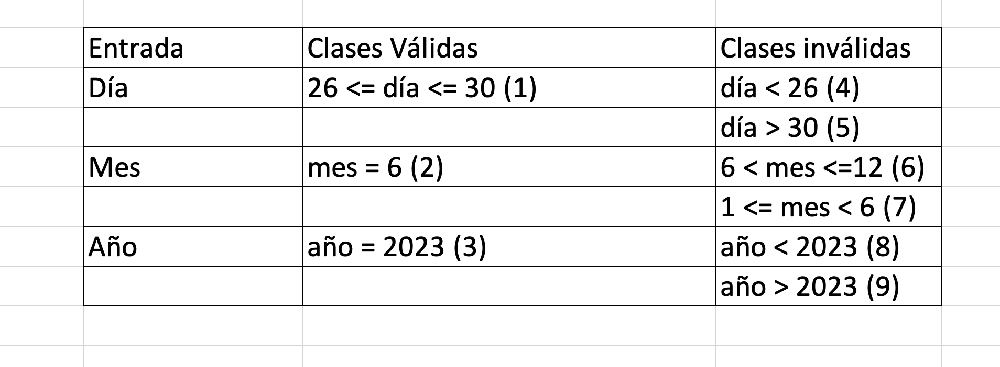
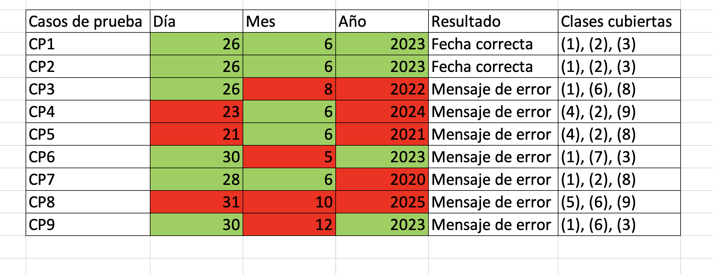

# Informe de testing 
Proyecto asignado: [https://github.com/ORT-FIS-2023S1/proyecto-aristimuno-bia-gonzalez]

## Test de sistema

### Detalles de sesiones de pruebas exploratorias

#### Sesión1
- Aplicación bajo prueba: Interfaz de Usuario
- Unidad de Tiempo: Corta
- Objetivo: Validar que la apariencia la aplicación a similar en distintos navegadores
- Tester: Guillermo Diotti
- Notas: En general, se observa un gran trabajo, sin embargo, para determinado tamaño de pantalla, se puede observar una inconsistencia, reportándola como issue en el bloque siguiente, Reporte de issues, en el aspecto a mejorar número 7

#### Sesión2
- Aplicación bajo prueba: Interfaz de Usuario
- Unidad de Tiempo: Corta
- Objetivo: Validar que la gramática y ortografía sean correctas en todo el sitio
- Tester: Guillermo Diotti
- Notas: En general, se observa un gran trabajo, sin embargo, se omiten algunas acentuaciones y algunas mayúsculas. Un ejemplo de acentuación se puede ver en la página principal, donde uno de los datos que se muestra es el Número de Identificación del estudiante, la palabra identidicación allí esta escrita sin tilde

#### Sesión3
- Aplicación bajo prueba: Interfaz de Usuario
- Unidad de Tiempo: Corta
- Objetivo: Validar consistencia en los distintos mensajes que emite la aplicación
- Tester: Guillermo Diotti
- Notas: En esta sesión, se pudieron observar algunas inconsistencias y errores a cambiar. Dichas temáticas fueron tratadas dentro de la sección Reporte de issues, en el error número 1, y error número 2 

#### Sesión4
- Aplicación bajo prueba: Interfaz de Usuario
- Unidad de Tiempo: Corta
- Objetivo: Combrobar valores límite los ditintos campos del formulario de ingreso del saldo
- Tester: Guillermo Diotti
- Notas: En esta sesión, para empezar, se pudo observar el correcto funcionamiento la mínima cota del saldo, pero por el otro lado, se vieron algunas inquietudes tratadas en los aspectos a mejorar número 1 y 2

#### Sesión5
- Aplicación bajo prueba: Interfaz de Usuario
- Unidad de Tiempo: Corta
- Objetivo: Validar el correcto funcionamiento de la reserva de un menú
- Tester: Guillermo Diotti
- Notas: Para la mayoría de los días, esta función funciona a la perfección, sin embargo, en el error número 3 se pueden ver aspectos que deben cambiarse para que su funcionamiento sea óptimo

### Casos de prueba

Debido a la falta de campos y por la limitada experiencia de usuario, no pudimos encontrar otra sección a la cual realizarle la técnica de partición equivalente

## Reporte de issues
Los issues propuestos se los podrían clasificar en errores y aspectos a mejorar
A su vez, se los clasifican en base a su prioridad, pudiendo esta ser de "Alta" prioridad, o "Baja" prioridad, o prioridad "media"

### Errores

#### Error 1

##### Resúmen del problema
En la sección del Calendario, hay una alerta que dice que no se puede seleccionar ni un sabado ni domingo en el calendario, sin embargo, hay sabados o domingos en donde la alerta que te pone es distinta

##### Pasos para visualizar el issue
- 1. Ir a la sección de Calendario
- 2. Seleccionar el día 17/06/2023, el cual es un Sabado, en el calendario
- 3. Presionar el botón Buscar
- 4. Verificar como aparece la alerta "No se pueden seleccionar los días sábado y domingo"
- 5. Seleccionar el día 01/07/2023, el cual es un Sabado, en el calendario
- 6. Presionar el botón buscar

##### Resultado
Aunque el último día de estos seleccionado es un Sábado, la alerta que aparece es distinta, por lo cual no se mantiene la alerta "No se pueden seleccionar los días sábado y domingo" durante todos los Sábados o Domingos

##### Grado de Severidad
Alta

#### Error2

##### Resúmen del problema
En la sección del Calendario, hay una alerta que dice "seleccione una fecha a partir de mañana", sin embargo, no se puede distinguir con total claridad a qué día se refiere con "mañana" y qué día es el que se considera como día actual para así verificar que se seleccione a partir del día siguiente
Hay casos erróneos en varios ámbitos. Para empezar, la alerta "seleccione una fecha a partir de mañana" resulta redundante ya que en algunos casos, seleccionando el mismo día en el que se está, se puede elegir un menú. Por ejemplo, el día actual de esta prueba es el 26/06/2023. Teniendo en cuenta la alerta anteriormente mencionada, solamente se podría elegir un menú a partir del día siguiente, aunque esto no es así, en el día 26/06/2023 a su vez se puede reservar.
Por otro lado, supongamos el día 19/06/2023, el cual es un día que ya pasó, si se fija, el sistema permite elegir un plato para este día, por lo que no tiene sentido

##### Resultado
Se puede observar una inconsistencia sobre a partir de cuál día se podría hacer una reserva de un plato, te sigue dejando hacer pedidos antes que el día actual

##### Grado de Severidad
Alta

#### Error3

##### Resúmen del problema
En un mismo día, hay platos los cuales no te los deja reservar más de una vez

##### Pasos para visualizar el issue
- 1. Dirigirse a la seccion de calendario
- 2. Seleccionar 27/06/2023 en el calendario y presionar Buscar
- 3. Agregar una reserva de Pechuga a la plancha con ensalada, el cual es el primer plato en la lista de menús para tal día
- 4. Dirigirse a la sección de registro de consumo y ver como este plato fue añadido
- 5. Verificar cómo el saldo disminuyó al pedir el plato
- 6. Repetir pasos de 2 y 3
- 7. Al ir a la sección de consumo se puede ver que este último no fue agregado
- 8. Al ir a la sección del registro de saldo, se puede verificar que el saldo no descontó este último plato, el plato no fue agregado

##### Resultado
Se puede observar que para un mismo día, no se pueden reservar más de un mismo plato. Este error no ocurre con todos los platos, sin embargo, no debería ocurrir

##### Grado de Severidad
Alta

### Aspectos a mejorar

#### Aspecto1
Estaría bueno que hubiese un maximo de carga de saldo, es decir, que no se pudiese cargar una cantidad mayor a dicha cifra
Por ejemplo, si se quisiera cargar $10.000.000, se puede sin problema, lo cual sería algo exagerado

##### Grado de Severidad
Media

#### Aspecto2
Estaría bueno de que haya un saldo tope, cota
Por ejemplo, si un usuario presenta un saldo de, digamos, $10.000, podría estar bueno de que no se pudiese ingresar un saldo adicional, ya que el máximo saldo que alguien pudiese tener, fuese ese

##### Grado de Severidad
Baja

#### Aspecto3
Estaría bueno de que en la sección Calendario, cuando se seleccione un Sábado o Domingo, la tabla se vaciara, desaparezca, indicando que no habría ningún menú para ese dia

##### Grado de Severidad
Baja

#### Aspecto4
Estaría bueno que la tabla dentro de la sección de registro consumo, se muestren los alimentos con su respectivo precio

##### Grado de Severidad
Media

#### Aspecto5
Estaría bueno poder elegir la cantidad de menús a elegir en un día en puntual, es decir, no tener la necesidad de hacer todo el mismo pedido para poder reservar más de una vez el mismo alimento en un mismo día en el caso de, por ejemplo, se quiera reservar para más de un estudiante

##### Grado de Severidad
Media

#### Aspecto6
Dentro de la sección del registro de saldo, hay un campo que te dice si queres cargar una cantidad específica se saldo
Estaría bueno que, una vez cargada la cantidad deseada, el campo se reseteara, vaciando el valor ingresado y poniendo en su lugar, por ejemplo, cero

##### Grado de Severidad
Baja

#### Aspecto7
Probando la responsividad, en determinados tamaños de pantalla, en el registro de saldo, los botones y el campo no quedan alineados

##### Grado de Severidad
Media

## Informe de calidad del sistema
Como método de introducción, se puede destacar que la página pone énfasis en poder realizar los pedidos para los días deseados, teniendo que indicar para ello un monto a recargar en la cuenta, para posteriormente pagar por la orden (que puede ser seleccionada antes de recargar saldo o previo a esta accion).
Mas allá de los errores aclarados arriba, es una página que para su propósito tiene una lógica de programación suficiente.
En cuanto al diseño se refiere, este es uno de los puntos más débiles de este proyecto, pues da la sensacion de haberse hecho con la metodología mobile-first y luego a la hora de llegar a resoluciones mas grandes el diseño es exactamente el mismo. No se aprovecha todo el tamaño correctamente para todas las dimensiones y hace que se vea de poca calidad.
Asimismo, se denota mucho la monotonía; no se implementa el uso de imagenes, iconos, secciones, etc. que otorgen algo "extra" en cuanto a diseño nos referimos. 
Otro punto en contra a destacar es que ya viene con datos precargados (por ejemplo, saldo, ordenes, etc), cosa que limita algunas funcionalidades que pudieron ser implementadas en la lógica para hacer mejor la experiencia de uso, lo que en parte, hace sentir limitado nuestro actuar en ella.

## Reflexión
En síntesis, (sin mencionar los errores ya aclarados anteriormente) es una página que cumple con su propósito, pero escatima bastante en los detalles y funcionalidades, dejando un poco de lado experiencia de usuario, sería deseable poder contar con detalles que pudiesen mejorar la misma.

    

