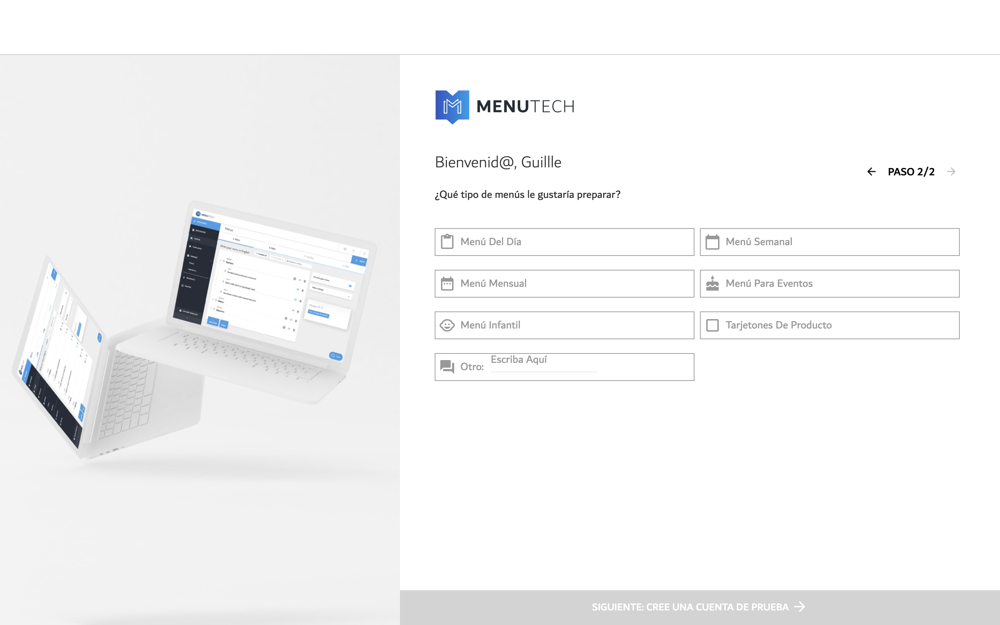

## MENUTECH
[**MENUTECH**](https://app.menutech.com) 

### Inicio
-   Al crear una cuenta, se puede elegir cuál  va a ser el propósito de la aplicación. Los propósitos disponibles se pueden ver en la siguiente foto. 

-   Tras elegir el propósito de la aplicación, tomando como referencia el propósito de menú escolar, se puede elegir características del producto, tanto como qué tipo de menú como la frecuencia de este. 

### Plantillas
-   En este procedimiento, se pueden elegir distintas plantillas para lo que se quiera hacer. 

### Nuevo Menú
-   Se elige entre las plantillas anteriores para crear un nuevo menú.
-   Se solicita el comienzo de, por ejemplo, la semana, y se genera una tupla donde te pide los platos principales y similares de cada día.
-   Se genera luego un documento PDF del menú. Ver el siguiente ejemplo 

### Mis menú
-   Se puede visualizar los menús que has creado.

### Gestión de Productos
-   Este procedimiento muestra una planilla de distintos alimentos.
-   Se puede administrar qué alimentos se quiere que aparezca en la lista.
-   Hay 3 formas de administrar la planilla.
        - Vista del Chef:
            -   Se muestra una planilla con la siguientes columnas. 
			
        - Vista del Traductor:
            -   Se muestra una planilla con la siguientes columnas. 

        - Vista Empresarial:
            - Se muestra una planilla con la siguientes columnas. (foto) 

### Administrar Inventario y Compras
-   Indica la cantidad de determinado artículo, su fecha de caducidad y su área de almacenamiento
