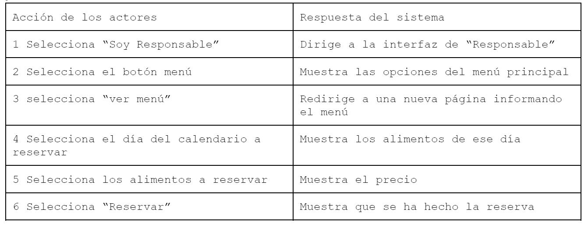
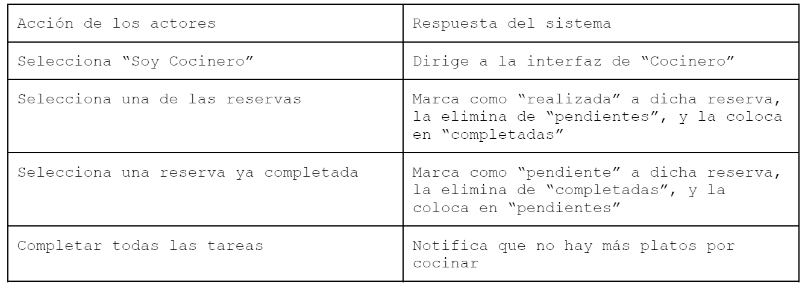

### Use Case 1
Título: Reservar menú
Actor: Responsable

Curso Normal:

Curso Alternativo:
6.1 Si el dia es el dia actual; muestra mensaje “No se puede reservar en el día”

### Use Case 2
Título: Consultar órdenes realizadas
Actor: Auxiliar de Comedor Escolar

Curso Normal:

Curso Alternativo:
Se puede dar click en una tarea “completada” para volver a ponerla como “pendiente”, en caso de que haya sido un error.
